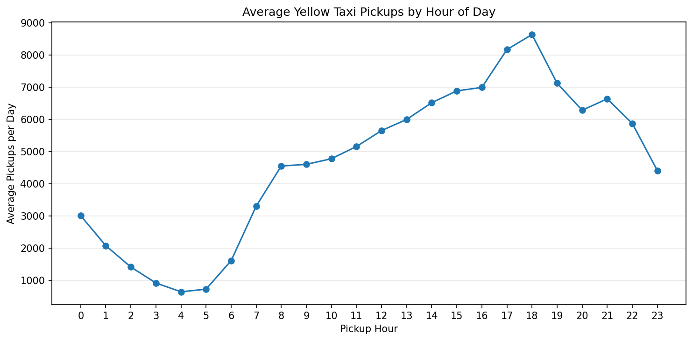
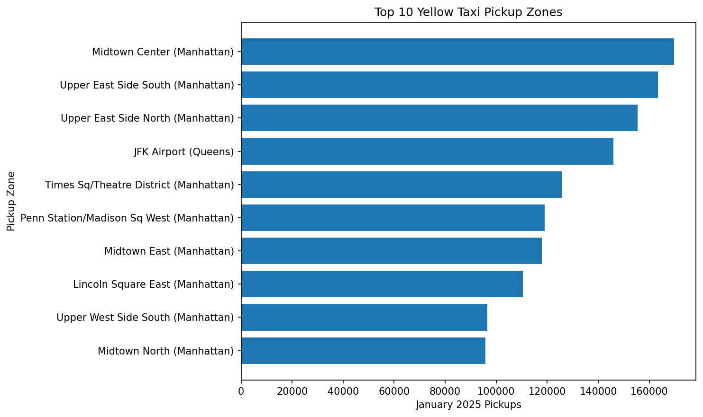
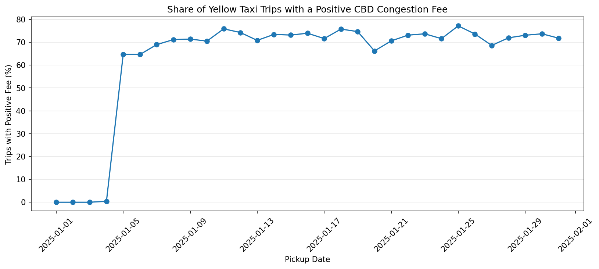
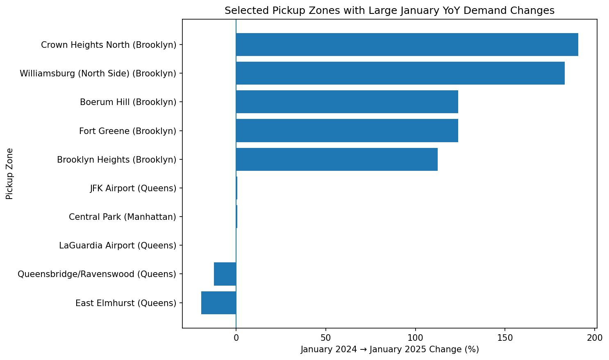
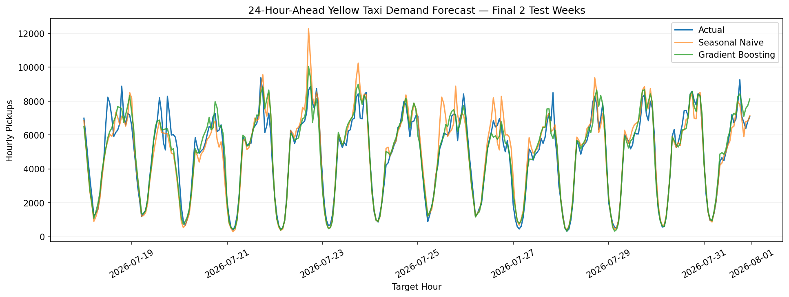
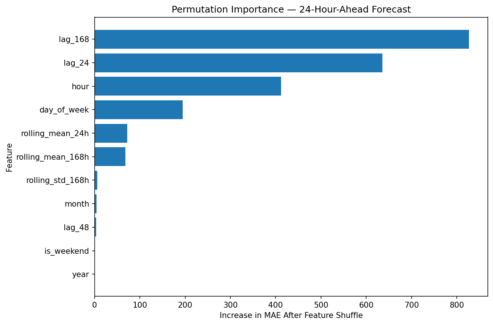

# NYC Yellow Taxi Demand, Congestion Pricing & Forecasting

An end-to-end analysis of NYC Yellow Taxi trip data, from raw data quality checks to demand forecasting.

The project focuses on three questions:

- **When and where is Yellow Taxi demand concentrated?**
- **How did January trip patterns change from 2024 to 2025 around the congestion-pricing period?**
- **Can historical demand predict citywide taxi pickups 24 hours ahead?**

The workflow uses official NYC Taxi & Limousine Commission (TLC) trip records and keeps the analysis intentionally transparent: task-specific cleaning, descriptive comparisons, time-aware validation, and a simple forecasting baseline before machine learning.

## Key Results

### Demand patterns

- January 2025 Yellow Taxi demand peaked at **18:00**, averaging about **8,636 pickups per day** during that hour.
- **Midtown Center** was the busiest pickup zone with **169,797 trips**.
- The **top 10 pickup zones accounted for 37.6%** of identifiable pickup demand.
- **Manhattan represented 89.1%** of zone-level Yellow Taxi pickups.
- Weekday and weekend demand both peaked around **18:00**, although average weekday volume was higher.





### Congestion-pricing period analysis

Using the same citywide cleaning rules for January 2024 and January 2025:

- Cleaned January Yellow Taxi pickup volume increased **17.2% year over year**.
- In January 2025, **64.7%** of cleaned trips recorded a positive `cbd_congestion_fee`.
- Among zones with at least 1,000 trips in both years, **Crown Heights North** had the largest increase (**+190.8%**) and **East Elmhurst** had the largest decline (**-19.5%**).
- The descriptive correlation between 2025 fee exposure and zone-level year-over-year demand change was **-0.272**.

The congestion-pricing section is **descriptive, not causal**. The results show associations and year-over-year changes, but they do not isolate the effect of congestion pricing from weather, holidays, taxi supply, economic conditions, transit changes, or other factors.





### 24-hour-ahead demand forecasting

The forecasting notebook uses hourly citywide demand from **January 2024 through July 2026**.

The final **8 weeks** are held out as a future test period:

- Training target range: **2024-01-08 23:00 to 2026-06-05 23:00**
- Test target range: **2026-06-06 00:00 to 2026-07-31 23:00**

A seasonal-naive forecast using the **same hour one week earlier (`lag_168`)** serves as the baseline.

| Model | MAE | RMSE | WAPE |
|---|---:|---:|---:|
| Seasonal Naive (`lag_168`) | 670.40 | 1,007.78 | 13.62% |
| HistGradientBoosting | **488.63** | **710.63** | **9.93%** |

The gradient-boosting model:

- reduced **MAE by 27.1%** relative to the seasonal baseline
- reduced **WAPE by 27.1%**
- had its highest average error around **23:00**
- had its highest day-of-week error on **Saturday**
- relied most heavily on **`lag_168`** according to permutation importance





## Project Workflow

### 1. Data Understanding

[`01_data_understanding.ipynb`](notebook/01_data_understanding.ipynb)

Started with the January 2025 Yellow Taxi file:

- **3,475,226 rows**
- **20 columns**
- reviewed schema, missingness, categorical values, timestamps, numeric anomalies, and taxi-zone coverage
- identified **540,149** records where `payment_type = 0` and `RatecodeID` was missing, showing structured rather than random missingness
- flagged extreme distances, negative fares, invalid durations, and other suspicious values without automatically deleting them
- validated pickup and drop-off LocationIDs against the official taxi-zone lookup

One important data-quality decision was to separate **problem detection** from **cleaning decisions**. For example, negative fares can appear in reversal/correction records, so they were not automatically removed from demand analysis.

### 2. Task-Specific Data Cleaning

[`02_data_cleaning.ipynb`](notebook/02_data_cleaning.ipynb)

Instead of creating one universal "clean" dataset, the cleaning rules depend on the analysis question.

**Citywide demand sample**

Removed:

- pickups outside January 2025
- non-positive trip durations
- durations above 6 hours

Result:

- **3,471,950 trips**
- **99.91% retention**

**Zone-level demand sample**

Starting from the citywide sample, excluded special pickup LocationIDs `264` and `265` because they cannot be assigned to a specific NYC taxi zone.

Result:

- **3,462,487 trips**
- **99.73% retention** relative to the citywide sample

### 3. Demand Analysis

[`03_demand_analysis.ipynb`](notebook/03_demand_analysis.ipynb)

Analyzed:

- hourly demand
- weekday vs. weekend patterns
- top pickup zones
- top-10 zone concentration
- borough-level hourly demand profiles

### 4. Congestion Pricing Analysis

[`04_congestion_analysis.ipynb`](notebook/04_congestion_analysis.ipynb)

Compared January 2024 and January 2025 using the same core cleaning rules.

Analyzed:

- citywide year-over-year pickup change
- daily positive CBD congestion-fee exposure
- pickup-zone demand changes
- zone-level fee exposure
- descriptive relationship between fee exposure and demand change

No causal claim is made.

### 5. Forecasting

[`05_forecasting.ipynb`](notebook/05_forecasting.ipynb)

Built a citywide hourly forecasting pipeline covering **2024-01 through 2026-07**.

Features include:

- hour
- day of week
- month
- weekend indicator
- `lag_24`
- `lag_48`
- `lag_168`
- lagged rolling means
- lagged rolling standard deviation

For a target hour `t`, demand features use information available at least **24 hours before `t`**. This prevents leakage from the hours immediately preceding the target.

The model is evaluated with a chronological holdout rather than a random split.

## Data

Source: [NYC Taxi & Limousine Commission — TLC Trip Record Data](https://www.nyc.gov/site/tlc/about/tlc-trip-record-data.page)

Main data used:

- NYC Yellow Taxi monthly Parquet trip records
- NYC Taxi Zone Lookup Table

Raw and processed datasets are intentionally excluded from GitHub because the monthly TLC files are large.

The forecasting notebook can download missing monthly Yellow Taxi files automatically.

## Repository Structure

```text
nyc-taxi-demand-analysis/
│
├── README.md
├── requirements.txt
├── .gitignore
│
├── notebook/
│   ├── 01_data_understanding.ipynb
│   ├── 02_data_cleaning.ipynb
│   ├── 03_demand_analysis.ipynb
│   ├── 04_congestion_analysis.ipynb
│   └── 05_forecasting.ipynb
│
├── images/
│   ├── 03_borough_hourly_profile.png
│   ├── 03_hourly_demand.png
│   ├── 03_top_pickup_zones.png
│   ├── 03_weekday_weekend_demand.png
│   ├── 04_daily_fee_exposure.png
│   ├── 04_fee_exposure_vs_zone_change.png
│   ├── 04_weekday_yoy_demand.png
│   ├── 04_zone_yoy_changes.png
│   ├── 05_actual_vs_forecast.png
│   ├── 05_demand_history.png
│   ├── 05_error_by_day.png
│   ├── 05_error_by_hour.png
│   └── 05_permutation_importance.png
│
└── data/
    ├── raw/          # ignored by Git
    └── processed/    # ignored by Git
```

## Tech Stack

- **Python**
- **Pandas**
- **NumPy**
- **PyArrow / Parquet**
- **Matplotlib**
- **scikit-learn**
- **Jupyter Notebook**

## How to Run

Clone the repository:

```bash
git clone https://github.com/Chris316-git/nyc-taxi-demand-analysis.git
cd nyc-taxi-demand-analysis
```

Create and activate a virtual environment:

```bash
python3 -m venv .venv
source .venv/bin/activate
```

Install dependencies:

```bash
python -m pip install -r requirements.txt
```

Run the notebooks in order:

```text
01_data_understanding.ipynb
02_data_cleaning.ipynb
03_demand_analysis.ipynb
04_congestion_analysis.ipynb
05_forecasting.ipynb
```

For notebooks 01–04, place the required TLC source files in `data/raw/`.

Notebook 05 can automatically download missing monthly Yellow Taxi Parquet files when:

```python
DOWNLOAD_MISSING_FILES = True
```

## Limitations

- Demand is measured by completed Yellow Taxi pickups, not unmet demand.
- The demand-analysis notebook focuses on January 2025 and does not represent every season.
- The congestion-pricing analysis compares observed periods and does not identify a causal treatment effect.
- The forecasting model does not include weather, major events, transit disruptions, or taxi-supply features.
- Forecast evaluation uses one final 8-week holdout rather than repeated rolling-origin validation.
- The forecast is citywide; zone-level demand forecasting is outside the current scope.

## Possible Extensions

- Add weather and holiday features
- Add event and transit-disruption data
- Use rolling-origin cross-validation
- Build zone-level demand forecasts
- Add prediction intervals
- Develop a formal causal design for congestion-pricing analysis

## Author

**Yanheng Li**  
M.S. Business Analytics, UC San Diego

[LinkedIn](https://www.linkedin.com/in/yanheng-li-974b57357/)
